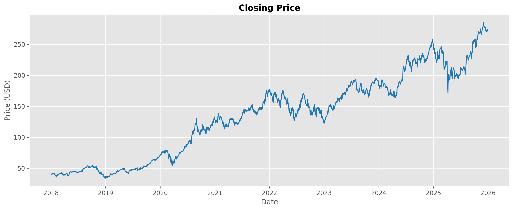
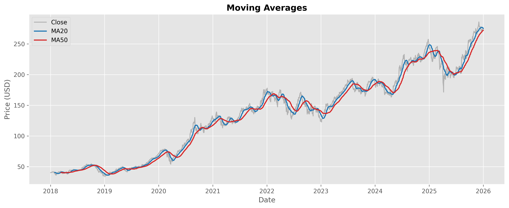
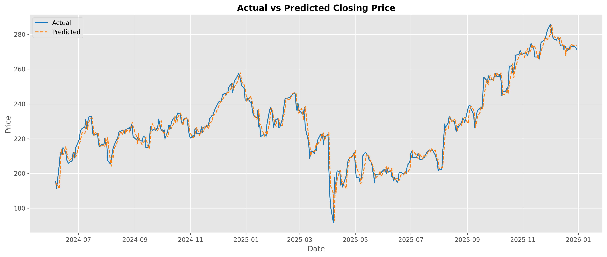
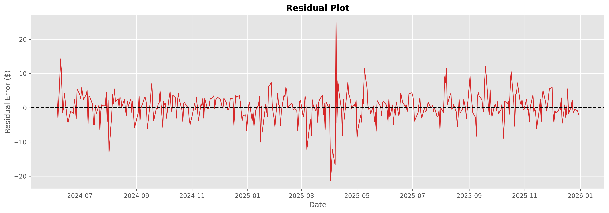
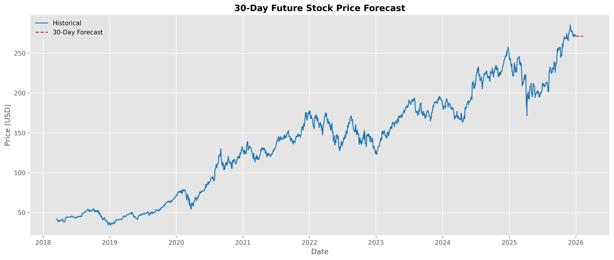

# 📈 Stock Price Forecasting using Time Series Analysis

## Overview
This project predicts future stock prices using historical stock market data for Apple Inc. (`AAPL`). The workflow encompasses:
- Data Collection
- Data Cleaning
- Exploratory Data Analysis (EDA)
- Feature Engineering
- Linear Regression Forecasting
- ARIMA Forecasting
- Model Evaluation
- Visualization

---

## Dataset
Historical Apple (`AAPL`) stock market prices downloaded dynamically using the Yahoo Finance API (`yfinance`) spanning from `2018-01-01` to `2026-01-01`.

---

## Technologies Used
- **Python**
- **Pandas**
- **NumPy**
- **Matplotlib**
- **Seaborn**
- **Scikit-learn**
- **Statsmodels**
- **yfinance**
- **Joblib**

---

## Workflow

```text
Download Stock Data
         ↓
    Clean Dataset
         ↓
        EDA
         ↓
Feature Engineering
         ↓
 Linear Regression
         ↓
       ARIMA
         ↓
  Model Evaluation
         ↓
   Visualization
         ↓
Forecast Future Prices
```

---

## Model Performance

| Model | MAE | RMSE | R² Score |
| :--- | :---: | :---: | :---: |
| **Linear Regression** | `2.91` | `4.19` | `0.97` |
| **ARIMA(5,1,0)** | `36.62` | `42.79` | `N/A` |

---

## Visualizations

### 1. Closing Price Trend


### 2. Moving Averages


### 3. Actual vs Predicted Prices


### 4. Residual Error Plot


### 5. 30-Day Future Forecast


---

## Future Improvements
- Implement Deep Learning architectures (**LSTM / GRU**).
- Tune ARIMA parameters using **auto_arima** / grid search.
- Evaluate **Prophet** forecasting for seasonal trends.
- Add technical market indicators (**RSI**, **MACD**, **Bollinger Bands**).
- Deploy as an interactive web dashboard via **Streamlit** or **FastAPI**.
